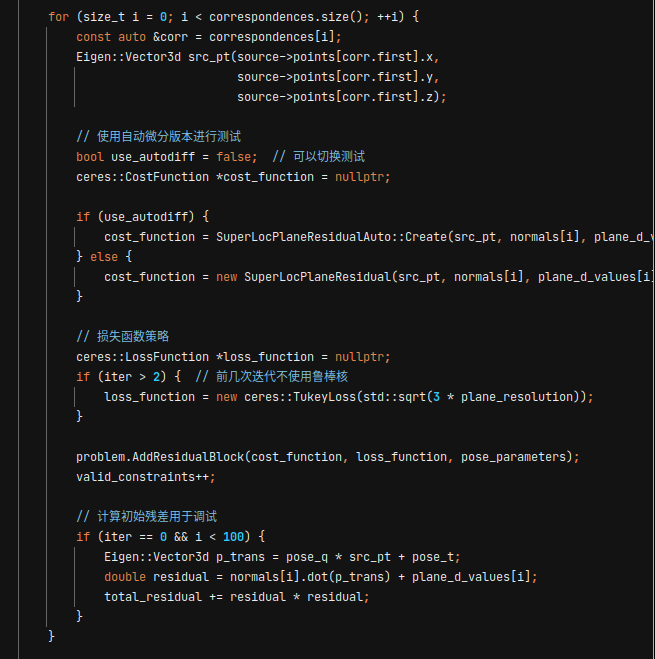
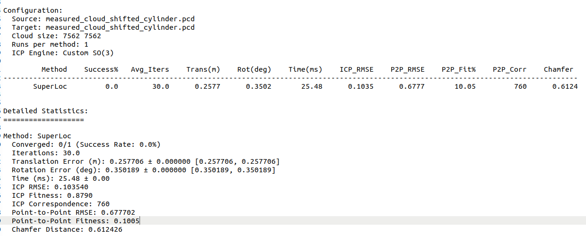
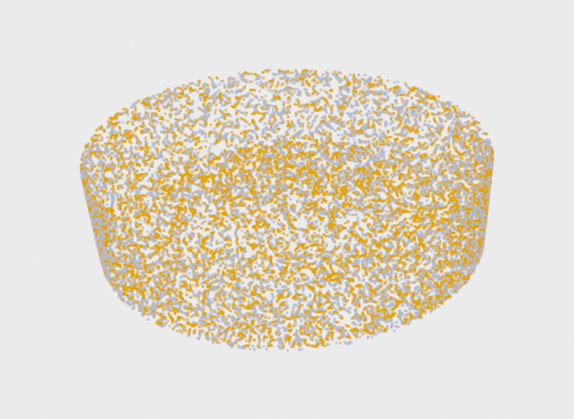

# SuperOdom-M
Minmal ICP case of SuperOdom for degenercy detetcion, only depending on Ceres and Eigen.

```c++
#include "superloc_icp_integration.h"

// 运行SuperLoc ICP
SuperLocICPIntegration::SuperLocResult superloc_result;
auto start_total = std::chrono::high_resolution_clock::now();

// 调用SuperLoc ICP，使用默认的plane_resolution = 0.1
bool success = SuperLocICPIntegration::runSuperLocICP(
        source_cloud_,
        target_cloud_,
        initial_matrix,
        config_.max_iterations,
        config_.search_radius,
        superloc_result,
        result.final_transform,
        result.iteration_data,  // 直接使用result的iteration_data
        0.1  // plane_resolution参数，对应原始SuperLoc的localMap.planeRes_
);

auto end_total = std::chrono::high_resolution_clock::now();


// cmakelist
find_package(Ceres REQUIRED)
find_package(TBB REQUIRED)
target_link_libraries(icp_test_runner2
        ${CERES_LIBRARIES}
        TBB::tbb
        )

```

You can use the Autodiff function of Ceres to verify  the Jacobian is corrected derived. Other configs are keep the same with SuperOdom.



in my desktop, here is a result for self-registration of a cylinder point cloud with initial pose (0.2m, 0.25m, 1.25m, 0 ,0, -50deg) .



Output log shows Z and yaw degenerate:

```bash
=== Method: SuperLoc ===
Detection: SUPERLOC (Feature Observability + Covariance)
Handling: SUPERLOC (Ceres-based SE3 optimization)
============================
[ICPContext::setTargetCloud] KdTree built for target cloud with 7562 points.

[SuperLoc] Starting SuperLoc ICP method...
[SuperLoc] Using Ceres-based SE(3) optimization
[SuperLoc] Parameters: max_iter=30, search_radius=1
[SuperLoc Debug] Initial state - t: [ 0.2 0.25 1.25], q: [        0         0 -0.422618  0.906308]
Failed to find match for field 'intensity'.
Failed to find match for field 'intensity'.
[SuperLoc Debug] Valid constraints: 3372, avg residual: 0.207057
[SuperLoc Debug] Iter 0, cost change: 94.0026 -> 18.0748, successful steps: 2
[SuperLoc Debug] Parameter change - trans: 1.03507, rot: 0.350189 deg
info Eigen values: 4.61058e-06 5.01252e-06   0.0001393  0.00215127  0.00240307    0.121005
info Eigen values: 0 0 0 0 0 0

[SuperLoc] === Final Results ===
[SuperLoc] Converged: No (after 30 iterations)
[SuperLoc] Final RMSE: 0.10354, Fitness: 0.879004
[SuperLoc] Transform error: trans=0.257706m, rot=50.1974deg
[SuperLoc] P2P RMSE: 0.677702, Chamfer: 0.612426

[SuperLoc] Feature Observability Analysis:
  Translation uncertainty - X: 1.000000, Y: 1.000000, Z: 0.003559
  Rotation uncertainty - Roll: 1.000000, Pitch: 1.000000, Yaw: 0.012456

[SuperLoc] Degeneracy Detection:
  Condition numbers - Full: 1.000000, Rot: 1.000000, Trans: 1.000000
  Is degenerate: Yes

[SuperLoc] Iteration History:
Iter	RMSE	Fitness	Corr#	TransErr	RotErr	Time(ms)
0	0.1035	0.8790	3372	0.2577	50.1974	16.0674

[SuperLoc] Total time: 25.4843 ms
[SuperLoc] ========================
```

the aligned cloud



Related package:  https://github.com/superxslam/SuperOdom

 
